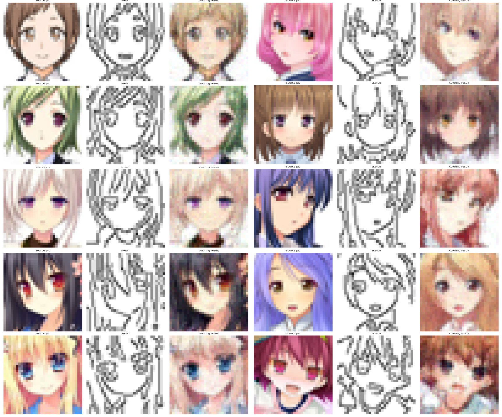

# 1. 介绍
这个项目可以实现简笔画上色。使用的方法是Flow Matching。

- 左边是数据集`anime_faces`的原图，中间是canny后的简笔画，右边是模型上色后的图像
- 训练时使用左边原图和简笔画进行训练
- 评估时输入简笔画，生成右边上色后的图像，左边和右边的图像可以直观对比

# 2.环境安装
```bash
conda env create -f environment.yml
```

激活环境
```bash
conda activate anime_faces
```

# 3. 下载并且解压数据集
- 使用的数据集是`anime_faces`，可以搜索HuggingFace获得。
https://huggingface.co/datasets/huggan/anime-faces
- 下载后将其解压，可以看到有2w+张图片。
- 移动到项目anime_sketch_coloring根目录下，并且更名为datasets，即`anime_sketch_coloring/datasets`。


# 4. 生成简笔画
我们需要先使用canny等方法先提取图片的边缘生成简笔画。
具体做法是
```bash
python -m preprocess.py
```

# 5. 训练模型
提供了以下训练例子：
1. 初始训练
```bash
python train.py \
    --scheduler_type onecycle \
    --num_epochs 300 \
    --lr 2e-4
```
    
2. 延长训练
```bash
python train.py \
    --resume checkpoints/best_model.pth \
    --num_epochs 500 \
    --reset_scheduler  # 重新开始学习率计划
```
    
3. 使用周期性重启（推荐）
初始训练
```bash
python train.py --scheduler_type cosine_restart --cosine_t0 50
```

继续训练（自动重启学习率）
```bash
python train.py \
    --resume checkpoints/best_model.pth \
    --scheduler_type cosine_restart \
    --num_epochs 500
```


4. 微调
```bash
python train.py \
    --resume checkpoints/best_model.pth \
    --finetune \
    --finetune_lr_ratio 0.1 \
    --num_epochs 350
```
还有关于模型和训练器的相关更多参数，都会保存下来以供重启。

建议使用`nvitop`监督显卡使用情况
```bash
nvitop --monitor
```
以及使用`tensorboard`监督训练情况
```bash
tensorboard --logdir=./logs
```
均已经包含在`environment.yml`中，无须再安装

# 6. 评估模型
提供了一些评估用例：
使用示例

1. 单张推理
随机选择一张简笔画
```bash
python inference.py --model checkpoints/best_model.pth
```

指定输入图像（彩色图）
```bash
python inference.py --model checkpoints/best_model.pth --input my_image.png
```

指定输入图像（已经是简笔画）
```bash
python inference.py --model checkpoints/best_model.pth --input sketch.png --use_sketch
```

使用更高质量的采样
```bash
python inference.py --model checkpoints/best_model.pth --steps 100 --method heun
```

2. 批量推理
批量处理验证集
```bash
python inference.py \
    --model checkpoints/best_model.pth \
    --batch \
    --batch_output_dir outputs/validation
```

批量处理前 20 个样本
```bash
python inference.py \
    --model checkpoints/best_model.pth \
    --batch \
    --num_samples 20 \
    --batch_output_dir outputs/sample_20
```

使用高质量采样
```bash
python inference.py \
    --model checkpoints/best_model.pth \
    --batch \
    --steps 100 \
    --method heun
```

3. 设置随机种子（可复现）
```bash
python inference.py --model checkpoints/best_model.pth --seed 42
```

